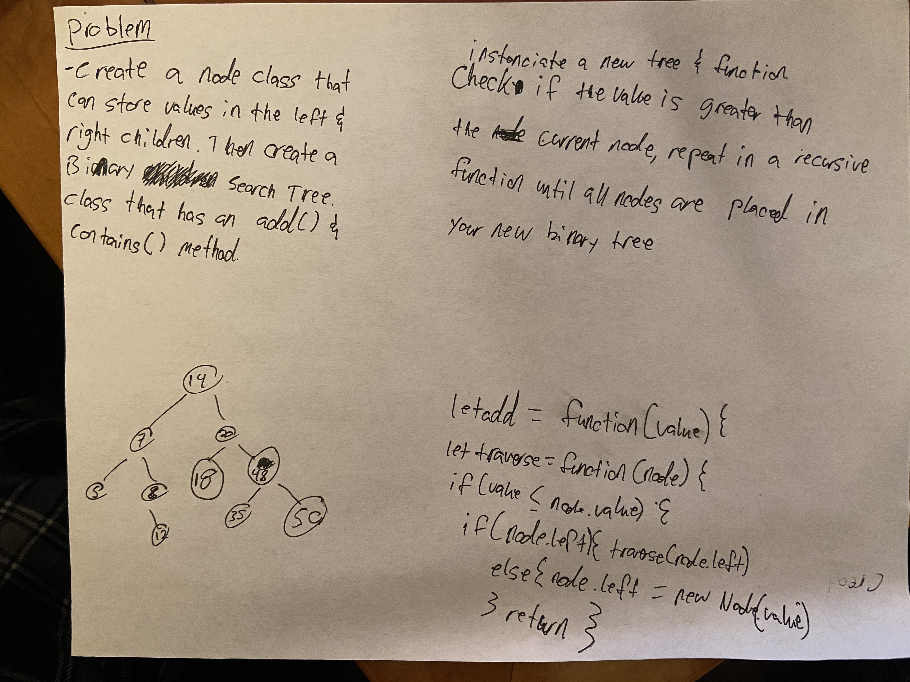

# Challenge Summary
Code Challenge DSA, Implement A Binary Tree and A Binary Search Tree.

## Challenge Description
Create a Node class that has properties for the value stored in the node, the left child node, and the right child node.

Create a BinaryTree class:

Define a method for each of the depth first traversals called preOrder, inOrder, and postOrder which returns an array of the values, ordered appropriately.
At no time should an exception or stack trace be shown to the end user. Catch and handle any such exceptions and return a printed value or operation which cleanly represents the state and either stops execution cleanly, or provides the user with clear direction and output.

Create a BinarySearchTree class:

Define a method named add that accepts a value, and adds a new node with that value in the correct location in the binary search tree.
Define a method named contains that accepts a value, and returns a boolean indicating whether or not the value is in the tree at least once.

## Approach & Efficiency
For the approach of this challenge, I created a Node class, and a Binary Tree class that had preOrder(), postOrder(), and inOrder() methods in it. Each of these methods traverse the Binary Tree in different ways. I then created a Binary Search Tree class that extends the Binary Tree class. This contains the add() and contains() methods, which add a new Node to a tree, and search to see if the Tree contains a specific value, respectively.

## Solution

